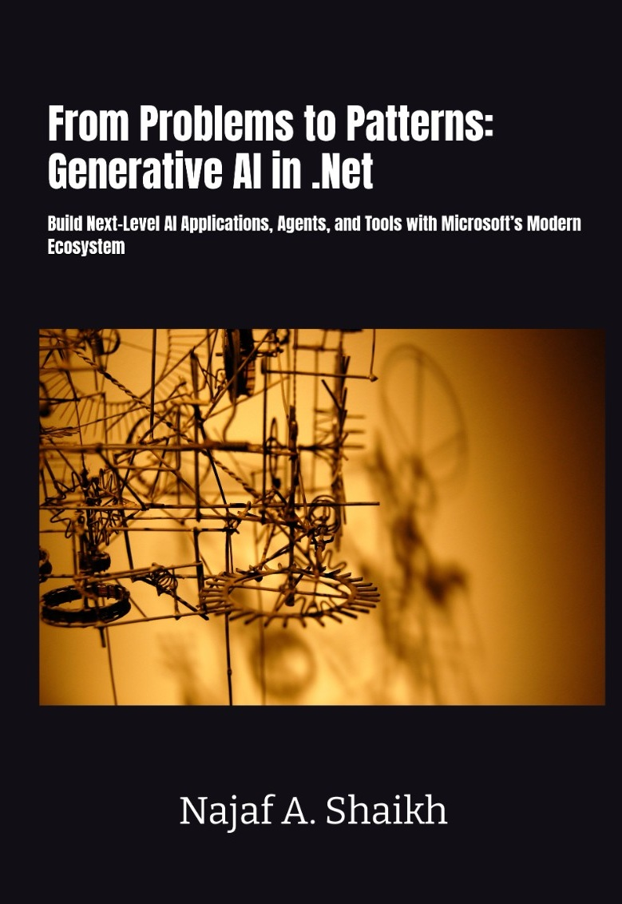

# From Problems to Patterns: Generative AI in .NET -- Companion Code
> Build Next-Level AI Applications, Agents, and Tools with Microsoft's Modern Ecosystem
<a href="https://www.amazon.co.uk/gp/product/B0H1718649">
  
</a>

[](https://github.com/CodeShayk/generative-ai-dotnet-samples/actions/workflows/ci.yml)

Runnable code samples for **Generative AI in .NET** by Najaf A. Shaikh.

Every sample in this repo corresponds to a section of the printed book. The full book-to-code map lives in [`docs/citation-index.md`](docs/citation-index.md). When the book condenses a section in favor of pointing here, the manuscript cites a **tag** (e.g. `v1.0-first-print`) so the cited code matches the print run -- `master` will drift as the surrounding APIs evolve.

> **About this code.** These are **teaching samples**, not production-grade libraries. They are written for clarity over coverage: each sample demonstrates a single technique, with error handling, retry, observability, and configuration shown to a useful depth rather than exhaustively. Patterns covered -- prompt caching, resilience, evaluation, model routing, output guards, MCP transports -- are real and copy-pasteable, but hardening, threat-modeling, and cost-bounding them for your environment is your responsibility.

## Layout

```
generative-ai-dotnet-samples/
├── AI in .Net.sln                              -- solution covering every sample + tests
├── Directory.Packages.props                    -- centralized NuGet versions
├── global.json                                 -- .NET 9 SDK pin
├── LICENSE                                     -- MIT
├── docs/
│   ├── citation-index.md                       -- book-section -> sample-path map
│   └── version-matrix.md                       -- pinned package versions per chapter
├── tests/                                      -- shared test infrastructure
├── .github/workflows/ci.yml                    -- build matrix (push, PR, weekly)
└── samples/
    ├── Directory.Build.props                   -- shared MSBuild properties
    ├── ch01-foundations/
    │   ├── 01.3-hello-chat/                    -- IChatClient with provider selection
    │   ├── 01.3-embeddings/                    -- IEmbeddingGenerator + cosine similarity
    │   └── 01.4-secrets-and-config/            -- appsettings + user-secrets + env vars
    ├── ch02-extensions-ai/
    │   ├── 02.1-console-chat-loop/             -- Sliding-window chat REPL
    │   ├── 02.2-streaming-aspnet/              -- SSE streaming in a Minimal API
    │   ├── 02.2-structured-output/             -- GetResponseAsync<T>()
    │   ├── 02.3-function-calling/              -- Weather + calendar + reminders tools
    │   ├── 02.4-middleware-pipeline/           -- Logging + caching pipeline
    │   └── 02.4-custom-middleware/             -- Token-budget DelegatingChatClient
    ├── ch03-rag/
    │   ├── 03.1-semantic-search/               -- Embedding + cosine over a catalog
    │   ├── 03.2-rag-basic/                     -- Retrieve / augment / generate
    │   ├── 03.2-ingestion-pipeline/            -- Load + chunk + hash + embed + upsert
    │   ├── 03.2.7-evaluation/                  -- LLM-as-judge for RAG (faithfulness + relevance)
    │   ├── 03.3-vision-extract/                -- Receipt image -> typed Receipt record
    │   └── 03.5-local-rag/                     -- Local-only RAG (Ollama)
    ├── ch04-agent-framework/
    │   ├── 04.2.1-hello-agent/                 -- ChatClientAgent hello world
    │   ├── 04.2.4-anthropic-agents/            -- Same agent API, Claude under the hood
    │   ├── 04.3-persistent-session/            -- Agent session serialize / resume
    │   ├── 04.4-tools-and-approval/            -- Function tools + RequiresApproval marker
    │   ├── 04.5-agent-middleware/              -- Custom run-middleware
    │   ├── 04.6.3-text-processing-walkthrough/ -- Linear workflow walkthrough
    │   ├── 04.6.7-content-workflow/            -- Researcher / Writer / Editor multi-agent
    │   ├── 04.7-a2a-server/                    -- Expose an agent via A2A protocol
    │   └── 04.8-agent-with-mcp/                -- Agent with mixed local + MCP tools
    ├── ch05-mcp/
    │   ├── 05.2.10-inventory-server/           -- Full MCP server (tools + resources + prompts)
    │   ├── 05.3.1-stdio-transport/             -- Minimal stdio server
    │   ├── 05.3.2-sse-transport/               -- ASP.NET Core SSE transport (legacy)
    │   ├── 05.3.3-streamable-http/             -- Streamable HTTP (recommended)
    │   ├── 05.4-mcp-client/                    -- Interactive MCP client REPL
    │   ├── 05.6.3-mcp-agent-factory/           -- McpAgentFactory
    │   └── cached-mcp-tool-provider/           -- CachedMcpToolProvider (caching wrapper)
    ├── ch06-production/
    │   ├── 06.1-observability/                 -- OpenTelemetry tracing + OTLP export
    │   ├── 06.2.1-resilience/                  -- Standard resilience handler
    │   ├── 06.2.4-model-routing/               -- Classify-then-route cost optimization
    │   ├── 06.5.1-unit-testing/                -- xUnit + StubChatClient
    │   ├── 06.5.3-llm-as-judge/                -- Evaluation harness
    │   └── output-guard-chat-client/           -- OutputGuardChatClient (PII + leak guard)
    └── appendix-a-packages/                    -- Quick-start bundles from Appendix A
```

## Prerequisites

- **.NET 9 SDK** (`dotnet --version` should be 9.0.x).
- **Provider credentials** for samples that hit a live model -- each sample's README names exactly which it needs:
  - `OPENAI_API_KEY` for OpenAI / GitHub Models samples.
  - `AZURE_OPENAI_ENDPOINT` + `AZURE_OPENAI_KEY` for Azure OpenAI samples.
  - `ANTHROPIC_API_KEY` for Claude samples.
- **[Ollama](https://ollama.com/)** for the offline samples and any sample that lists Ollama as its default profile.

The repo uses **central package management** -- versions live in [`Directory.Packages.props`](Directory.Packages.props), shared MSBuild properties in [`samples/Directory.Build.props`](samples/Directory.Build.props). Project files only carry `<PackageReference Include="..." />` -- no version attributes.

## Configuration and secrets

All samples read configuration in the standard .NET cascade: `appsettings.json` -> `appsettings.Development.json` -> environment variables -> User Secrets. **No sample contains a hardcoded API key.** Where User Secrets are required, the sample's README spells out the exact `dotnet user-secrets set` commands.

For local development, prefer User Secrets:

```bash
dotnet user-secrets init --project samples/ch01-foundations/01.3-hello-chat
dotnet user-secrets set "OpenAI:ApiKey" "<your-key>" --project samples/ch01-foundations/01.3-hello-chat
```

For anything beyond a developer workstation -- CI, shared environments, deployed services -- use your platform's secret manager (Azure Key Vault, AWS Secrets Manager, Doppler, etc.). Do not commit `appsettings.Development.json` or `.env` files containing keys; the repo's `.gitignore` already excludes the common patterns, but the responsibility is on you.

## Running a sample

```bash
dotnet run --project samples/ch04-agent-framework/04.6.3-text-processing-walkthrough
```

Each sample folder has its own `README.md` with run instructions, expected output, and the manuscript section it backs.

## Building everything

```bash
dotnet build
```

builds the full `AI in .Net.sln` solution from the repo root.

## What's offline-runnable

These samples need **only** Ollama (no API keys, no cloud calls):

- `ch01/01.3-hello-chat` (default profile), `01.3-embeddings`, `01.4-secrets-and-config`
- `ch02/02.1-console-chat-loop`, `02.2-streaming-aspnet`, `02.4-middleware-pipeline`, `02.4-custom-middleware`
- `ch03/03.1-semantic-search`, `03.2-rag-basic`, `03.2-ingestion-pipeline`, `03.5-local-rag`
- `ch04/04.2.1-hello-agent`, `04.3-persistent-session`, `04.5-agent-middleware`, `04.7-a2a-server`
- `ch05/*` (all MCP samples; `05.4-mcp-client` needs a server to talk to)
- `ch06/06.1-observability`, `06.2.1-resilience`, `06.5.1-unit-testing`, `output-guard-chat-client`

The rest assume an OpenAI / Anthropic / Azure OpenAI key.

## Cost expectations

Cloud-provider samples spend real money against your account. Most are single-shot prompts that come in well under a cent at current OpenAI / Azure OpenAI / Anthropic pricing. The two exceptions worth flagging:

- `03.2-ingestion-pipeline` embeds a multi-document corpus -- expect a few cents per full ingestion run, depending on the embedding model.
- `06.5.3-llm-as-judge` and `03.2.7-evaluation` issue judge calls per evaluated response -- a 50-row golden set against a frontier model is typically tens of cents.

If you intend to run any sample unattended (CI, scheduled jobs, scripts), set per-key spend caps in your provider console first.

## Continuous integration

CI runs on every push and pull request, plus a weekly Monday build to catch transitive package drift. The matrix builds every sample in the `samples/` tree against the pinned versions in `Directory.Packages.props`. A green badge above means the print-tagged code still compiles end-to-end. If the badge is red, check the latest [Actions run](https://github.com/CodeShayk/generative-ai-dotnet-samples/actions/workflows/ci.yml) for the breaking package or API change before assuming the samples are wrong.

CI catches build-level drift but not all runtime regressions. For the model-ID surface that ships in Appendix B, run the live-API smoke harness at [`tests/AnthropicVerification/`](tests/AnthropicVerification/) -- it iterates each cited Claude model ID against the live Anthropic API and reports `PASS`/`FAIL` per model. Each verification pass is recorded in [`docs/verification-log.md`](docs/verification-log.md).

## Known issues

- **`Anthropic.SDK` 5.10 ↔ `Microsoft.Extensions.AI` 10.5 binding gap (mitigated).** `Anthropic.SDK` 5.10.0 is compiled against `Microsoft.Extensions.AI.Abstractions` 10.3.0; the central pin is 10.5.0 (required by `Microsoft.Agents.AI` 1.3), which reshapes `HostedMcpServerTool.AuthorizationToken`. Calling Claude through Anthropic.SDK's bundled `IChatClient` bridge therefore throws `MissingMethodException` at runtime against the central pins. **Mitigation (2026-05-03):** `samples/ch04-agent-framework/04.2.4-anthropic-agents` ships a thin local adapter, `AnthropicChatClient.cs`, that calls `AnthropicClient.Messages.GetClaudeMessageAsync` directly and translates Anthropic ↔ M.E.AI types itself, bypassing the broken `ChatClientHelper`. The sample builds clean and runs end-to-end (two-turn live conversation confirmed against `claude-haiku-4-5-20251001`). The throwaway harness at `tests/AnthropicVerification/` is unaffected -- it has no `Microsoft.Agents.AI` dependency and keeps a local `VersionOverride` to M.E.AI 10.3.0. **Cleanup:** once `Anthropic.SDK` 5.11+ ships rebuilt against M.E.AI 10.5+, delete `AnthropicChatClient.cs`, revert `Program.cs` to `IChatClient chat = new AnthropicClient(apiKey).Messages;`, drop the `VersionOverride` on the verification harness, and re-run both. Full chain in `docs/verification-log.md` (entries `2026-05-02` and `2026-05-03`).

## Versioning and tags

| Tag | Meaning |
|---|---|
| `v1.0-first-print` | Code as it appears in the first print run of the book. |
| `v1.x-second-print` | Updated for any subsequent print revisions (placeholder; not yet cut). |
| `master` | Always-current; tracks latest stable .NET 9 + Microsoft.Extensions.AI. May drift from any specific print run. |

Use a **tag** in any URL you cite from the book -- never `master`.

## Contributing

Issues are welcome -- bugs, builds broken by transitive package drift, samples whose APIs have moved on, README mistakes. Pull requests are welcome too, especially:

- Build fixes for newer NuGet releases.
- README clarifications (per sample or repo-wide).
- New offline-runnable variants of samples that currently require cloud keys.

Before opening a PR: run `dotnet build` from the repo root and confirm the affected sample(s) still run. If you change observable behavior, update the sample's README.

## Errata

Open an issue at [github.com/CodeShayk/generative-ai-dotnet-samples](https://github.com/CodeShayk/generative-ai-dotnet-samples/issues). Confirmed errata roll into the next print tag and are noted in the parent book's errata page.

## License

MIT -- see [`LICENSE`](LICENSE).
